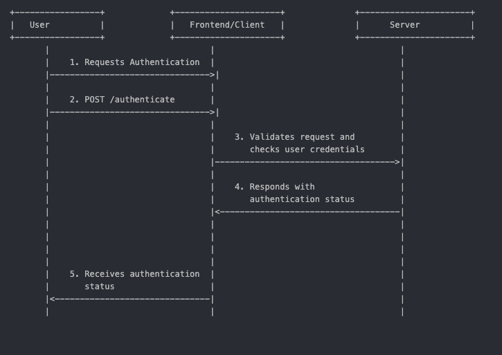

# CS361_microservice

Your RESTful API Name
Your RESTful API is designed to provide authentication and registration services. It exposes endpoints for user authentication and registration, allowing clients to securely access and manage user data.

Getting Started
To use this API, follow the instructions below.

Prerequisites
Make sure you have the following prerequisites installed:

Python 3.x
pip (Python package installer)
Installation

Clone the repository:
git clone https://github.com/your-username/your-restful-api.git

Navigate to the project directory:
cd your-restful-api

Create a virtual environment:
python -m venv venv
Activate the virtual environment:

On Windows:
venv\Scripts\activate

On macOS/Linux:
source venv/bin/activate

Install dependencies:
pip install -r requirements.txt

Usage

Start the API server:
python main.py
The server will run at http://127.0.0.1:5000/.

Use a tool like curl, httpie, or your preferred HTTP client to make requests.

Endpoints
Authentication
Endpoint: /authenticate
Method: POST
Request:
{
  "username": "your_username",
  "password": "your_password"
}
Response:
{
  "username": "your_username",
  "encrypted_message": "your_encrypted_message"
}

Registration
Endpoint: /register
Method: POST
Request:
{
  "username": "new_username",
  "password": "new_password",
  "encrypted_message": "new_encrypted_message"
}
Response:
{"message": "User registered successfully"}

Additional Information
Ensure that requests include the necessary parameters in the JSON payload.
Review the API documentation for detailed information on each endpoint.
This README provides a basic guide; consult the API documentation for advanced features and error handling.

UML DIAGRAM:

